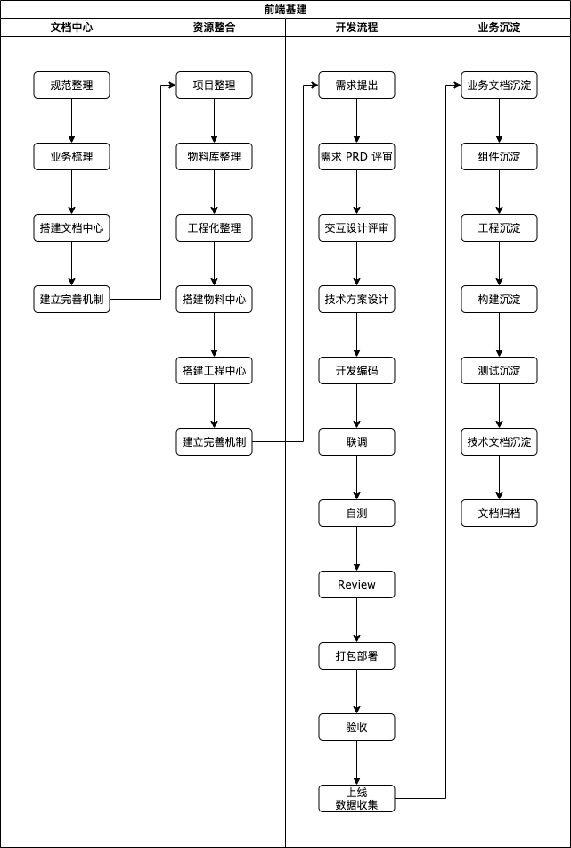
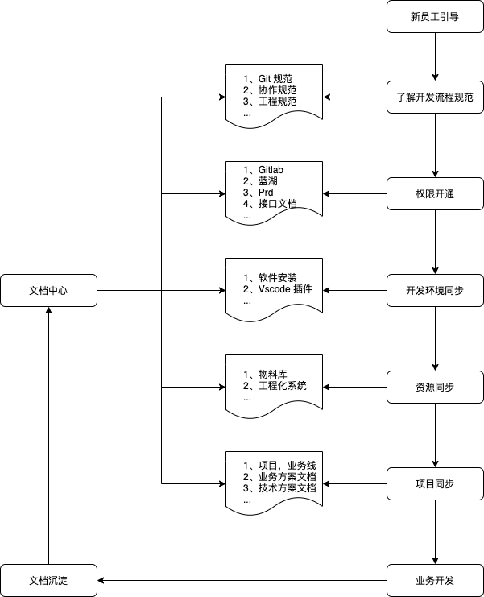
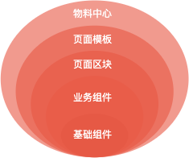
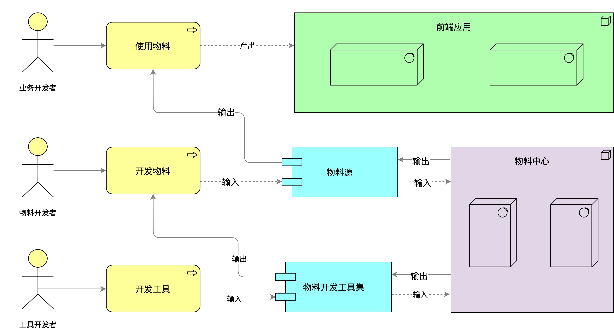
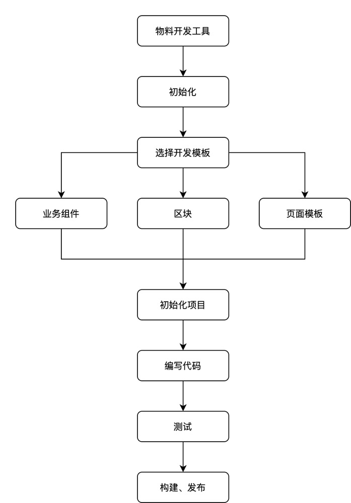

# 前端基建

> 一切基建源于业务，并服务于业务

本文基于常规**中后台业务**，描述从 0 到 1 构建前端基建体系的那些事。本文仅从全局的角度讲解基建过程会遇到什么，有哪些处理方式，对于细节不会有深入的讲解。对于个别需要详细说明的部分，会分文章补充讲解。

你将获得：

- 对前端业务全链路流程有一个全面、清晰的了解；
- 前端基建全貌及相关方案；

适合人群：

- 爱折腾；
- 有技术团队管理与规划的需求；
- 不限前端工程师；

**注意：基建与业务关系密切，本文不可能完全适用于读者公司实际场景，仅供参考，切勿生搬硬套。**

## 背景

首先，我们来了解一下，什么是基建、基建的意义以及基建落地可能存在的问题与挑战。

### 什么是基建

> 以提效为目的，服务于业务的建设称之为基建，可作为团队技术沉淀是否丰富的评判标准。

基建通常包括但不限于：

- **团队规范：** 团队标准化共识，标准化规范是团队高效协作的必要前提；
- **研发流程：** 业务研发链路，标准化流程直接影响上下游的协作和效率；
- **基础资产：** 工具链、物料库（组件、区块、模板等）、团队 DSL 沉淀等；
- **工程管理：** 项目全生命周期的低成本管控，如：项目创建、本地环境配置、打包部署；
- **安全防控：** 三方包依赖安全、代码合规性检查、安全风险检测等防控机制；
- **质量保障：** 自测 checkList、单测、UI 自动化测试、链路自动化测试；
- **性能检测：** 通过自动化、工具化的方式发现页面性能瓶颈，提供优化建议；
- **统计监控：** 埋点方案、数据采集、数据分析、线上异常监控等。

### 基建的意义

> 对于每个团队来说，肯定是业务优先，但高效的业务处理离不开基建的支撑。

基建意义归结如下：

- 解决业务问题
- 研发效能提效
- 团队梯队建设
- 团队影响力提升

### 问题与挑战

> 基建不是一个团队的口号，落地确实会遇到不少问题

包括但不限于：

- 如何找到适合做基建的人？
- 如何合理地做基建规划？
- 如何在业务开发中找到基建的机会，有方法论吗？
- 如何衡量基建带来的价值？
- 如何合理处理基建与业务的时间、人力管理？
- 如何提升团队基建氛围？
- 如何在公司层面推广基建？

希望在接下来的内容中，你能找到想要的答案。

### 目标

结合以上内容，初步拟定基建目标如下：

- [x] 基建人才梯队管理方案
- [x] 常规业务场景的基建规划方案
- [x] 基建的反馈机制
- [x] 基建的内部完善机制
- [x] 基建的内外合作机制

## 方案

### 选人方案

> 基建首先要解决的是人的问题，团队有没有适合做基建的人，该如何挑选？

专业技能：

- 不设限语言，全栈最优；
- 不设限领域，眼界开阔；
- 扎实的前端基础知识；
- 组件化、工程化、架构，Devops 等；

综合方面：

- 基础夯实、技术攻坚、学习能力强；
- 拥抱业务、关注细节、执行力强；
- 责任心、心态开放、有同理心；
- 爱折腾、善于总结与分享；

挑选机制：

- 以周为维度的 CodeReview；
- 以月为维度的技术分享；
- 以季为维度的职责调岗；

### 规划

> 基建会随着业务的增长变得愈发重要，可视团队情况逐步进行。

常规业务流程下的基建过程：

我们从以下四个部分来描述基建的建设过程：

- 文档中心
- 资源整合
- 开发流程
- 业务沉淀

#### 文档中心

> 文档中心的搭建要优于其他基建，并在完成业务过程中，不断完善文档中心内容。

**文档中心可作为所有基建资源的唯一入口，如：团队规范、物料中心、工程中心等。**

对于刚搭建文档中心的公司，可对现有开发、业务规范进行整理，最终通过以下方式建立线上文档中心：

- [语雀](https://www.yuque.com/)
- [Vuepress](https://vuepress.vuejs.org/)
- [Docusaurus](https://docusaurus.io/)

推荐 Docusaurus（ 或 Vuepress ） 结合版本管理的方式维护前端团队相关文档。

此外，我们可以从新员工引导的角度去思考整个文档中心的内容建设：

文档中心完善机制（以 Docusaurus + Gitlab 为例）：

- 新增与更新文档采用 Gitlab 提交 PR 的形式审核；
- 结合 Gitlab webhook 或者 shell 脚本命令完成部署操作；
- 部署环境搭建视公司情况而定；

#### 资源整合

> 文档中心搭建完成后，可对公司整体业务进行梳理。

主要从以下维度出发：

- 项目技术栈规整
- 项目依赖规整
- 项目技术债规整
- 物料库资源规整
- 工程化相关规整

规整的目的在于：

- 资源复用
- 问题收集
- 统一标准

#### 物料中心

> 物料可用于标准化页面元素组成。

包含但不限于以下内容：

- 基础组件：对 DOM 元素及交互逻辑高内聚的封装，外部可通过传递 Props 的方式对其进行定制；
- 业务组件：由基础组件根据业务需要组合而成；
- 区块：由基础、业务组件组合而成的代码片段，不对外提供配置属性，仅通过拷贝代码的形式放到项目中，通常区块内部还包含事件处理、状态管理、数据请求等逻辑；
- 模板：对区块进行组合，就形成了特定的模板；

物料用户关系图：

搭建物料中心的意义在于：

- 研发提效
- 提高项目可维护性
- 视觉与交互标准化

物料开发流程：

物料开发工具可以是基于 Node 的命令行工具，视公司具体情况采用不同的模式开发物料，最终沉淀出来的内容有：

- 物料开发脚手架
- 物料统一打包配置
- 物料统一发布配置
- 物料平台，可统一使用 [Storybook](https://storybook.js.org/) 作为文档输出载体

社区可参考的物料中心：

- [羚珑](https://ling.jd.com/jdw/docs/concept_widget)
- [飞冰](https://ice.work/)
- [Material Center](https://fusion.design/mc?spm=fusion-design.mc-design-fusion.0.0.67d133e6UnL6bn)
- [antd](https://pro.ant.design/blog/better-block-cn)

##### 组件库

> 组件库是前端领域一个重要的技术单元，为效率、质量、体验服务

- 效率：抽象业务研发中 UI 共同点，避免重复；
- 质量：通过测试和 UI 走查，质量有保证；
- 体验：交互统一，表现一致；

组件库类型：

- PC 端：面向用户和商户的大多都是较为独立的产品，标准化意义其实不大，通常采用社区标准组件库，如 Antd、Element-UI；
- 移动端：组件库定制需求比较多，条件允许可从零搭建；

建设步骤：

- 了解业内相关设计规范；

  - [ant design](https://ant.design/docs/spec/introduce-cn)
  - [material design](https://material.io/)
  - [atomic design](https://bradfrost.com/blog/post/atomic-web-design/)

- 了解 [styled system](https://styled-system.com/)，知道如何从全局角度去设计组件库的主题定制系统；
- 与设计部门制定视觉组件标准，共同创建视觉组件库；
- 与 UED 侧制定完善的组件新增流程，在业务前端研发侧有强同步的约束；
- 从团队情况出发确定技术选型、文档方案、包管理及迭代策略等；

推荐阅读：

- [如何打造一个高效的前端组件库](https://awps-assets.meituan.net/mit-x/slide-bundle-2018-2/40/Vix%20%E2%80%94%E2%80%94%20%E5%A6%82%E4%BD%95%E6%89%93%E9%80%A0%E4%B8%80%E4%B8%AA%E9%AB%98%E6%95%88%E7%9A%84%E5%89%8D%E7%AB%AF%E7%BB%84%E4%BB%B6%E5%BA%93.pdf)
- [开源的 React Native 组件库](https://tech.meituan.com/2018/09/27/waimai-beeshell-popularize.html)
- [开源 React Native 组件库 beeshell 2.0 发布](https://tech.meituan.com/2019/09/26/open-source-react-native-component-library-beeshell.html)

#### 工程中心

> 什么是前端工程化？本质上就是将前端开发流程，标准化、规范化、工具化、自动化、简单化。通过规范和工具来提高前端应用质量及开发效率

包括但不限：

- 开发规范
- 脚手架
- 构建工具
- Mock 服务
- 单元测试
- 项目部署
- 可用性建设

##### 开发规范

视团队情况，可以考虑如下开发规范：

- 目录结构
- 命名规则
- 开发工具规范（[Eslint](https://eslint.org/)、[prettier](https://prettier.io/)、[editorconfig](https://editorconfig.org/)）
- Git commit 规范

业内规范：

- [京东凹凸实验室代码规范](https://guide.aotu.io/docs/index.html)
- [clean-code-javascript](https://github.com/ryanmcdermott/clean-code-javascript?utm_source=gold_browser_extension)
- [Airbnb 团队](https://github.com/airbnb/javascript)
- [百度 fex 团队](https://github.com/fex-team/styleguide)

##### 脚手架

> 脚手架用于快速生成新项目的目录模板，并集成一系列体系化工具的安装，能够提升前端开发人员的效率，减少 copy 操作

常见脚手架：

- [vue cli](https://cli.vuejs.org/)
- [create-react-app](https://create-react-app.dev/)
- [parcel](https://createapp.dev/parcel)

通常团队需要定制化适合团队开发的脚手架工具，涉及的常用工具库如下：

- [child_process](http://nodejs.cn/api/child_process.html)：用于执行 shell 命令
- [commander](https://github.com/tj/commander.js/blob/master/Readme_zh-CN.md)：用于处理控制台命令
- [inquirer](https://github.com/SBoudrias/Inquirer.js#readme)：用于控制台问答
- [semver](https://github.com/npm/node-semver#readme)：用于版本检测提示
- [fs-extra](https://github.com/jprichardson/node-fs-extra)：用于 fs 操作询问
- [execa](https://github.com/sindresorhus/execa#readme)：用于执行终端命令
- [chalk](https://github.com/chalk/chalk#readme)：用于控制台颜色设置

脚手架可以采用 monorepo 的方式拆分项目配置项粒度，可参考 [jslib-base](https://github.com/yanhaijing/jslib-base)

##### 构建工具

> 构建工具可以让我们更好地自动化处理包括（es6 转换，css、js 压缩，less、sass 的转换等），让我们不再需要手动地去重复做这些事情，解放开发人员的双手，更好地聚焦到业务上的开发，构建本质上就是将代码“串”起来，然后压缩并混淆，最终构建出目标代码文件。

- 基于任务运行:

  - [gulp](https://gulpjs.com/)
  - [grunt](https://gruntjs.com/)

- 基于模块化打包

  - [webpack](https://webpack.js.org/)
  - [parcel](https://parceljs.org/)
  - [rollup](https://rollupjs.org/guide/en/)
  - [browserify](http://browserify.org/)

- 整合型

  - [yeoman](https://yeoman.io/)

##### Mock 服务

> Mock 指是解决前端在完成页面搭建后，此时需要联调后端接口时，后端接口尚未开发完成，还无法联调时前端可以先按照事先与后端约束好的数据结构来模拟接口数据来走完开发（ 一般是通过后端接口文档比如 Swagger ），实现真正意义上的前后端分离。

主要方式包括但不限于：

- 数据拦截型：通过模拟 Http 请求对相应匹配的接口进行真实请求拦截，返回模拟的数据，如：[mockjs](http://mockjs.com/)；
- [json-server](https://github.com/typicode/json-server)：是一个 Node 模块，通过运行 Express 服务器，可以直接把一个 json 文件作为一个具备全 RESTful 风格的 API,并支持跨域、jsonp、路由订制等功能的 web 服务器，也可结合 mockjs；
- 可视化接口管理平台：[rap](https://github.com/thx/RAP)、[easy-mock](https://github.com/easy-mock/easy-mock)，[Yapi](https://github.com/YMFE/yapi)；

自研接口平台可考虑：

- 标准化的接口文档
- 提供给前端使用的标准化假数据
- 提供给前端的 TS 类型定义
- 提供给后端使用的单测

##### 单元测试

> 单元测试是工程化中用来确保项目质量及代码质量的一个环节，虽然测试并不能直接地减少 bug，但是可以减少因为反复修改过程中新生成的 bug，因为当你修改代码时，很容易忽略之前设定的一些逻辑，导致系统出现故障。

准备工作：

- 需要先选定一个单元测试框架：[jest](https://jestjs.io/)、[Mocha](https://mochajs.org/)、[Karma](https://karma-runner.github.io/latest/index.html) 等；
- 制定测试规则；
- 约束团队单元测试覆盖率最小值：比如函数覆盖率达到 80%，那么如果每次自动化测试达不到这个条件，项目就发布失败，直到完成目标条件；

遵循规则:

- 假设：如：`test('formatTime() 默认格式，返回时间格式是否正常', () => {})` 指定完成测试所要达成的条件；
- 当：所要执行的操作，如：`date.formatTime(1586934316925)` 执行这个函数的测试；
- 那么：得到的结果，既获得断言 如：`expect(date.formatTime(1586934316925,'yyyy.MM.dd')).toBe('2020.04.15')`；

##### 项目部署

前端工程化项目部署涉及到的几个主流工具：

- [jenkins](https://www.jenkins.io/)：一个可扩展的自动化服务器，可以用作简单的 CI 服务器，具有自动化构建、测试和部署等功能；
- [docker](https://www.docker.com/)：虚拟环境容器,可以将环境、代码、配置文件等一并打包到这个容器中,最后发布应用；
- [npm](https://www.npmjs.com/)： Node.js 官方提供的包管理工具，主要用来管理项目依赖，发布
- [nginx](https://www.nginx.com/): 可以作为 Web 服务器，也可以作为负载均衡服务器，具备高性能、高并发连接；
- [pm2](https://pm2.keymetrics.io/)：node 进程管理工具，可以利用它来简化很多 node 应用管中繁琐任务

##### 可用性建设

> 从业务后台服务往上，一直到用户界面，一切都是前端服务，这里面一切用户可能遇到的问题都是前端可用性的范畴。

前端服务可用性包含三个部分：

- 前端代码可用性（测试质量、线上异常）
- 静态资源服务可用性（NGINX、Node、CDN）
- 网络链路可用性（DNS 劫持、网络性能）

可用性的保障分为三个阶段：

- 事前
- 事中
- 事后

保障手段分为三个大类：

- 软的：是指用 “人” 来保障的部分：

  - 流程保障
  - 规范保障
  - 测试保障

- 硬的：是指用 “工程工具” 来保障的部分：

  - 静态代码检查
  - 单测
  - Web 自动化测试
  - 持续集成
  - 线上前端异常监控
  - 业务异常监控
  - 前端服务异常监控
  - 网络异常监控

- 根源的：是整个可用性保障的核心，是指通过 “技术选型” 来让系统更健壮，这里面有两个核心点：

  - 技术选型要简单稳健（技术上避免被动，应具备源码维护能力）
  - 避免出现核心链路上的可用性短板

#### 私有 npm 仓库

公司私有 npm 仓库具备：

- 稳定性
- 私密性
- 安全性

现有 npm 源：

- [npm](https://www.npmjs.com/)
- [cnpm](https://cnpmjs.org/)
- [taobao](https://npm.taobao.org/mirrors/)

搭建方案：

- [cnpmjs.org](https://www.npmjs.com/package/cnpmjs.org)

基础环境：

- Linux 服务器
- node 环境
- 数据库( Mysql )
- nginx

扩展功能：

- 进程管理（PM2）
- 私有包存储上云（[nfs 模块规范](https://www.v2ex.com/t/294255)）

推荐阅读：

- [分分钟教会你搭建企业级的 npm 私有仓库](https://juejin.cn/post/6844904196651630599#heading-0)

<!-- ## 单元测试

## 前端规范

## rollup

## 运维部署

## SSR、构建时预渲染

## 离线化技术 -->
