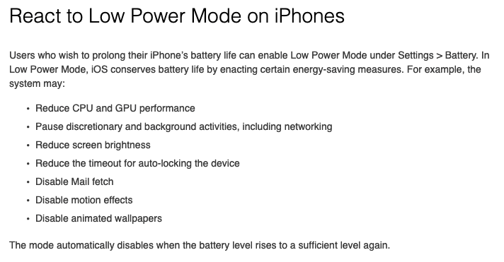
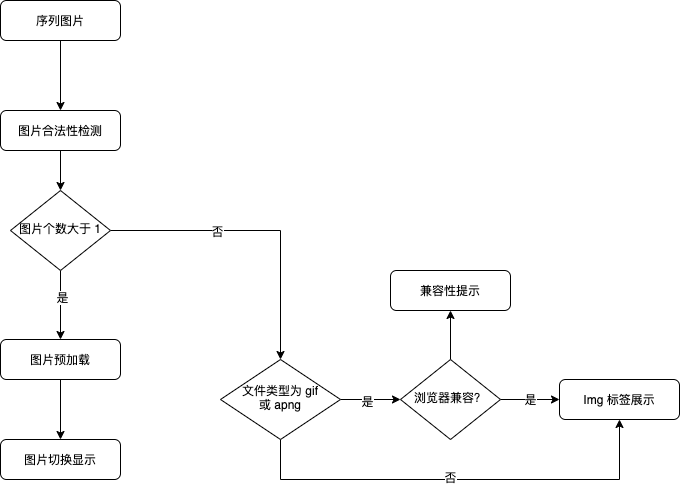
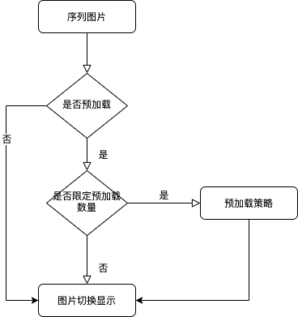
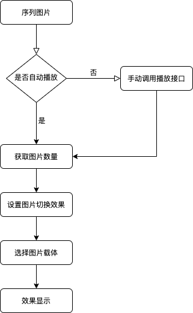
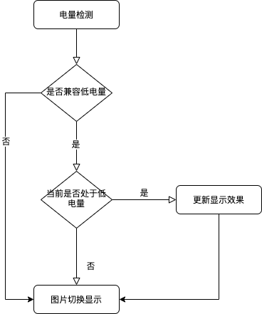
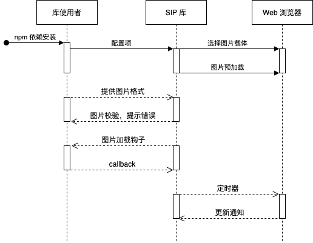
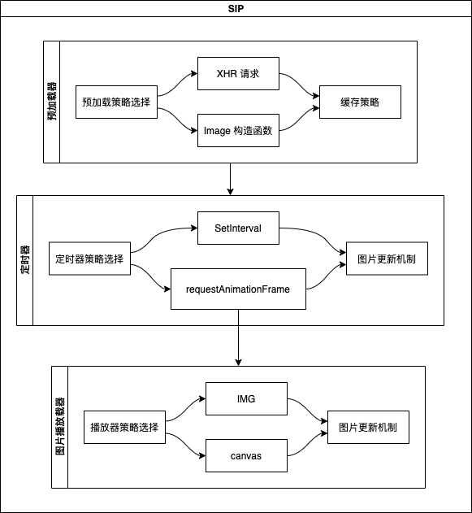
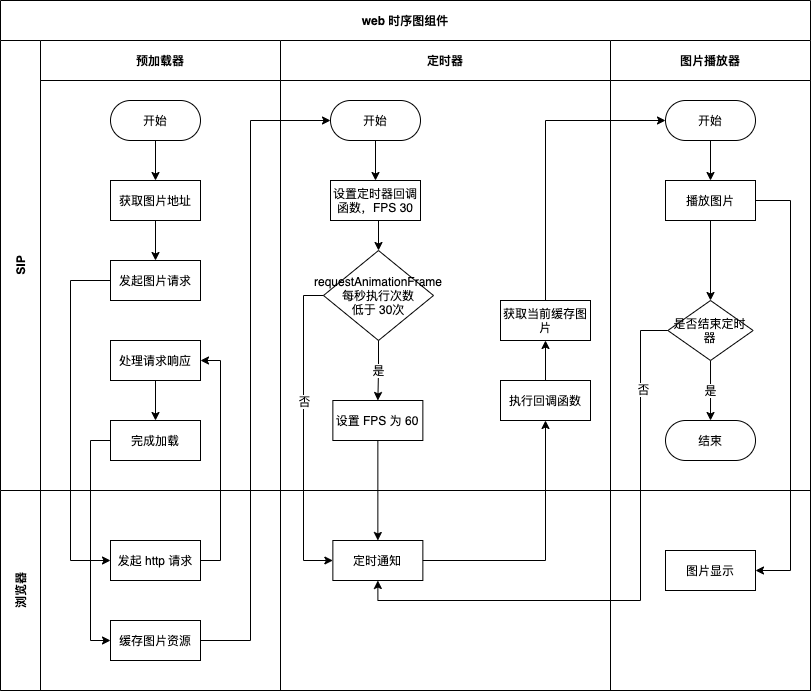
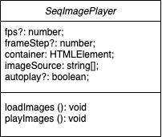

# Web 序列图播放组件设计文档

SIP（seq-image-player，以下简称 SIP）是使用序列图片，通过 JS 脚本模拟**视频播放**效果。

## 一、背景

在微微科技官网、招聘 H5 页面中（Web），需要在首屏显示类似视频播放效果的序列图，并且循环显示。由于是序列图，所以对**声音不作要求**。

### （一）现有方案

截止 2021 年，浏览器支持的动态效果图片格式有：

| 格式 | 体积 | 解码方式 | 特效支持        | 兼容性         |
| ---- | ---- | -------- | --------------- | -------------- |
| GIF  | 适中 | 软解     | 只支持 8 位色彩 | 全平台         |
| Apng | 较大 | 软解     | 全支持          | IE 不支持      |
| Webp | 最小 | 软解     | 全支持          | IE、IOS 不支持 |

综上，浏览器原生动图方案存在一定的兼容性问题，并且移动端浏览器生态较为杂乱。此时就需要一种能解决跨平台的序列图播放组件。（对于 Web 中各图片细节对比可参见 [图像文件类型与格式指南](https://developer.mozilla.org/en-US/docs/Web/Media/Formats/Image_types)）

### （二）问题分析

首先，来了解一下视频动画大概原理，视频动画其实就是由一张张连贯起来的图片连续播放组成的，当一秒内有 24 张图片快速播放，人眼就会认为这是一幅连续的画面，这便是动画的由来。而帧率指的就是每秒播放的图片数量，如 24 帧即每秒播放 24 张图片，60 帧即每秒播放 60 张图片，以此类推。

其次，如果要模拟视频播放的效果，步骤如下：

1. 获取视频对应的序列图片（通常由视频转换而得）；
2. 选择图片播放器；
3. 以一定的速率播放图片，如：每秒 60 张（60 fps）；

另外，用时序图组件替代视频、Gif 等现成方案来实现视频效果，可能存在以下问题：

- 图片资源大小问题，如：视频转为序列图后，是否比原视频大。
- 图片加载问题，如：图片加载失败，是否要预加载达到最好播放效果；
- 图片切换显示问题，如：切换出现卡顿现象；

对于使用 IOS 的用户（不排除安卓手机也有类似情况），可能遇到以下受限：

硬件设备处于低能耗的状态下对浏览器性能的影响，如：IOS 低电量下，浏览器 requestAnimationFrame 会由 60fps 降为 30fps。详情[参见](https://developer.apple.com/library/archive/documentation/Performance/Conceptual/EnergyGuide-iOS/LowPowerMode.html)

最后，对于库的使用者来说，可能存在以下疑问：

- 图片格式对最终输出是否有不同影响；
- 图片序列显示的视频效果如何设置；
- 图片显示如何做到性能最优；
- 图片及交互效果是否能动态修改；
- 图片资源问题；
- 库的扩展性等。

## 二、组件目标

前面我们对背景有了简单的了解，下面来针对性地做一些目标设定：

- [x] 支持主流浏览器
- [x] 支持预加载功能
- [x] 支持可配置的播放速率
- [x] 支持自适应窗口宽度
- [x] 支持低电量模式下性能最优
- [ ] 支持动态图片切换及自定义交互效果显示 (暂不要求)
- [ ] 支持扩展性 (暂不要求)

公司内部测试机型[要求](http://172.16.6.175:8090/pages/viewpage.action?pageId=64848505)：

## 三、关键流程

结合背景与目标，下面将从以下几个流程来对 Web 时序图播放组件进行分析。

### （一）主流程

用于描述时序图组件从接收序列图之后具体需要经过哪些流程：

### （二）预加载流程

用于描述（一）主流程中预加载具体流程：

### （三）序列图显示流程

用于描述（一）主流程中序列图显示具体流程：

### （四）设备低能耗处理流程

用于描述（三）序列图显示流程中设备低能耗处理具体流程：

## 四、关键技术

分析完关键流程后，下面针对背景和目标对 Web 时序图播放组件中涉及的关键技术加以说明。

### （一）预加载技术

Web 中实现预加载需要完成以下步骤：

1. 提供预加载资源地址
2. 通过浏览器发起资源请求
3. 监听加载资源完成回调

实际开发中，可通过实例化浏览器提供的 Image 类来发起图片资源请求，并监听每张图片的 onload 事件，同时可以缓存 Image 实例。

### （二） 序列图片视频化技术

Web 中实现序列图片视频化需要完成以下步骤：

1. 提供预加载后图片缓存实例
2. 设置图片播放帧率，如 30 FPS
3. 选择图片播放器，如 canvas
4. 以每秒 30 张的方式在播放器上显示图片

实际开发中，可通过 `requestAnimationFrame` 每秒执行 60 次的特性，执行对应 callback 的方式来实现每秒播放 60 张图片。详情参见 [7.1 web 定时器细节对比](#一web-定时器细节对比)

### （三） 设备低能耗处理对策

对于 IOS 设备下浏览器定时器处理步骤如下：

1. 设置图片定时播放器默认 fps
2. 检测是否低电量
3. 针对低电量表现动态调整 fps

实际开发中，通过设置图片定时器（requestAnimationFrame）默认 fps 为 30，此时表现为每秒执行的次数为 30 次 （也就是每秒可以播放 30 张图片，满足人眼对视频帧率的要求）。在低电量的情况下，表现为 Web 自带定时器帧率减半，如 60 fps 降低为 30 fps。

若需要保持正常与低电量下视频效果一致，低能耗下 fps 设置为 60（此情况下设备对 web 定时器有降帧处理，实际 fps 为 30），正常情况下 fps 设置为 30，即可满足视频效果一致性的要求。

## 六、接口设计

对关键流程和技术有了一定的了解之后，接下来开始接口相关设计。

### （一）使用者、web 时序组件、浏览器三者关系

首先来了解使用者、库、浏览器之间的关系：

### （二）功能模块划分

通过以上内容的梳理，对于 Web 序列图组件来说，需要实现如下功能：

- 图片合法性检测
- 图片视频化效果设置
- 低电量检测及效果调优
- 图片预加载
- 图片播放器选择
- 定时器选择及更新机制处理

对应模块关系图：

### （三）功能模块关系图

### （四）类设计

通过对各模块能的分析，类接口初步设计如下：

对应参数说明如下：

| Name        | Type     | Default | Description      |
| :---------- | :------- | :------ | :--------------- |
| fps         | Number   | 30      | 每秒播放图片张数 |
| frameStep   | Number   | 0       | 跳帧数           |
| container   | Node     | null    | 容器 DOM         |
| imageSource | string[] | []      | 图片资源         |
| autoPlay    | boolean  | true    | 是否自动播放     |

对应实例方法说明如下：

| Name       | Type | Default | Description    |
| :--------- | :--- | :------ | :------------- |
| loadImages | func |         | 加载图片资源   |
| playImages | func |         | 运行图片播放器 |

## 七、参考资料

- [图像文件类型与格式指南](https://developer.mozilla.org/en-US/docs/Web/Media/Formats/Image_types)
- [炫酷 H5 中序列图片视频化播放的高性能实现](https://www.zhangxinxu.com/wordpress/2018/05/image-sequence-html5-video-play/)
- [React to Low Power Mode on iPhones](https://developer.apple.com/library/archive/documentation/Performance/Conceptual/EnergyGuide-iOS/LowPowerMode.html)
- [When iOS throttles requestAnimationFrame to 30fps](https://popmotion.io/blog/20180104-when-ios-throttles-requestanimationframe/)
- [jpg-vs-jpeg](https://kinsta.com/blog/jpg-vs-jpeg/)
- [FPS](https://zh.wikipedia.org/wiki/%E5%B8%A7%E7%8E%87)
- [setInterval](https://developer.mozilla.org/zh-CN/docs/Web/API/WindowOrWorkerGlobalScope/setInterval)
- [requestAnimationFrame](https://developer.mozilla.org/zh-CN/docs/Web/API/Window/requestAnimationFrame)

### （一）web 定时器细节对比

传统的 javascript 动画是通过定时器 `setTimeout` 或者 `setInterval` 实现的。但是定时器动画一直存在两个问题：

- 动画的循环时间间隔不好确定，设置长了动画显得不够平滑流畅，设置短了浏览器的重绘频率会达到瓶颈，推荐的最佳循环间隔是 17ms（大多数电脑的显示器刷新频率是 60Hz，1000ms/60）
- 定时器第二个时间参数只是指定了多久后将动画任务添加到浏览器的 UI 线程队列中，如果 UI 线程处于忙碌状态，那么动画不会立刻执行。

为了解决这些问题，H5 中加入了 `requestAnimationFrame`， 其优势在于充分利用显示器的刷新机制，比较节省系统资源。显示器有固定的刷新频率（60Hz 或 75Hz），也就是说，每秒最多只能重绘 60 次或 75 次，`requestAnimationFrame` 的基本思想就是与这个刷新频率保持同步，利用这个刷新频率进行页面重绘。此外，使用这个 API，一旦页面不处于浏览器的当前标签，就会自动停止刷新。这就节省了 CPU、GPU 和电力。不过有一点需要注意，`requestAnimationFrame` 是在主线程上完成。这意味着，如果主线程非常繁忙，`requestAnimationFrame` 的动画效果会大打折扣

视频化效果参数设置：

Web 序列图要实现视频效果，首先需要获取定时器支持，如：使用 `requestAnimationFrame` 每次重绘时切换图片播放器当前图片，`requestAnimationFrame` 默认每秒执行 60 次，符合视频效果的每秒播放 60 张图片 (60fps)。`requestAnimationFrame` 因设备节能措施导致执行次数降低问题，可以将视频 fps 统一降为 30 fps 以达到视觉效果一直体验。

想要控制视频速度，可以通过调整 fps ，当 fps 固定时，在保证视频效果的情况下，可以通过跳帧来达到播放提速的效果。（即：固定每秒播放张数，但总张数减少。）
